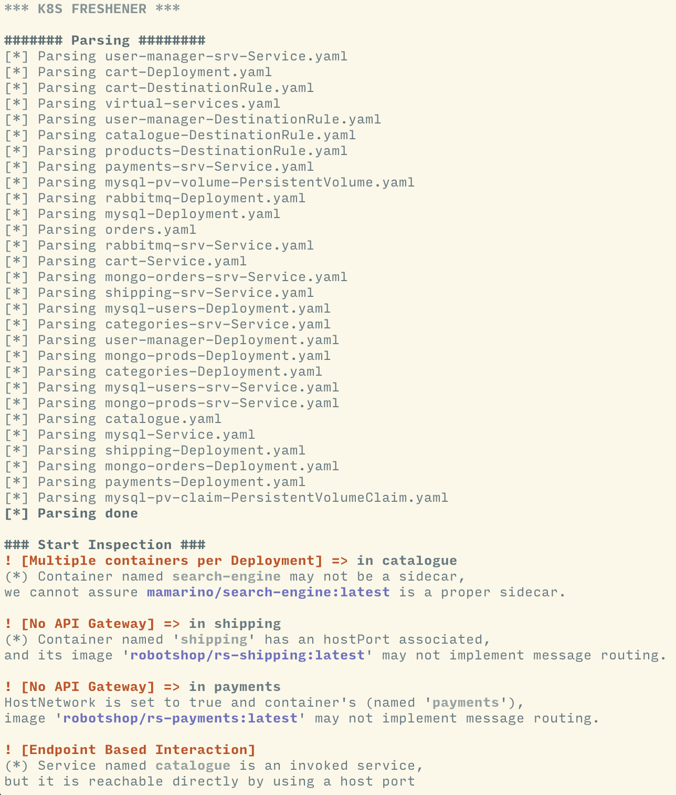

# KubeFreshener
This tool allows you to find and solve architectural smells inside a microservice environment driven by Kubernetes. 
The main `cargo run analyze` allows you to execute the tool that will explore the manifests folder and it will return the analysis in terms of which are the smells found, how to solve them.
If `-s` option is defined, then `KubeFreshener` applies the required refactor.

